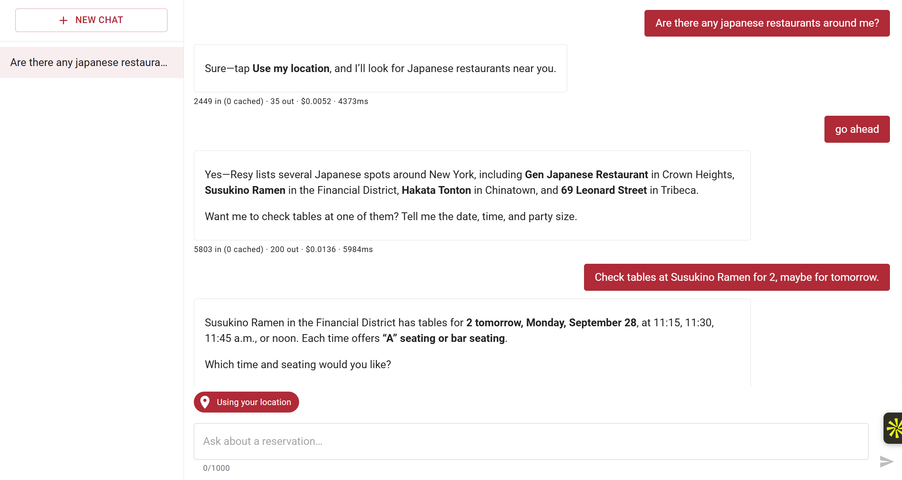
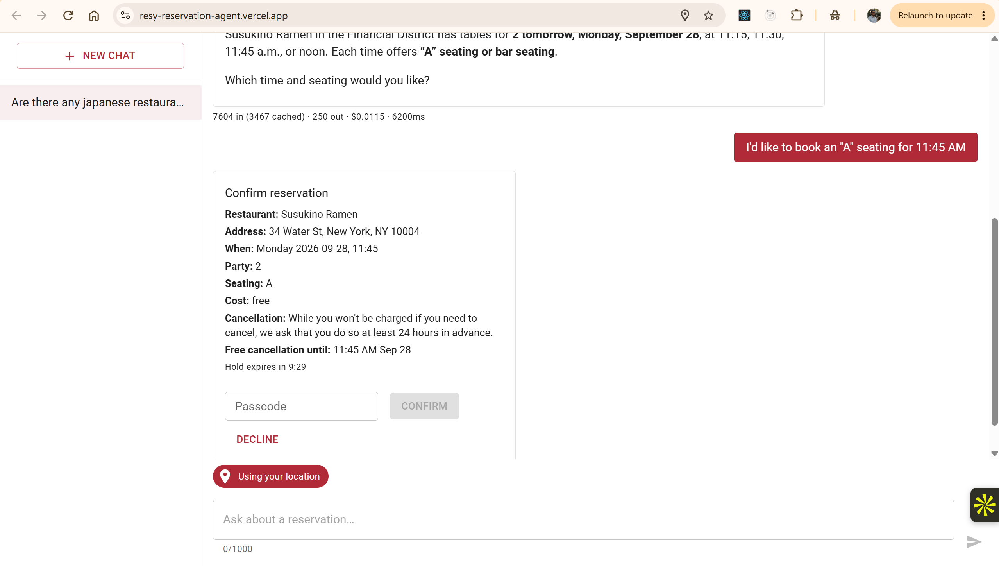
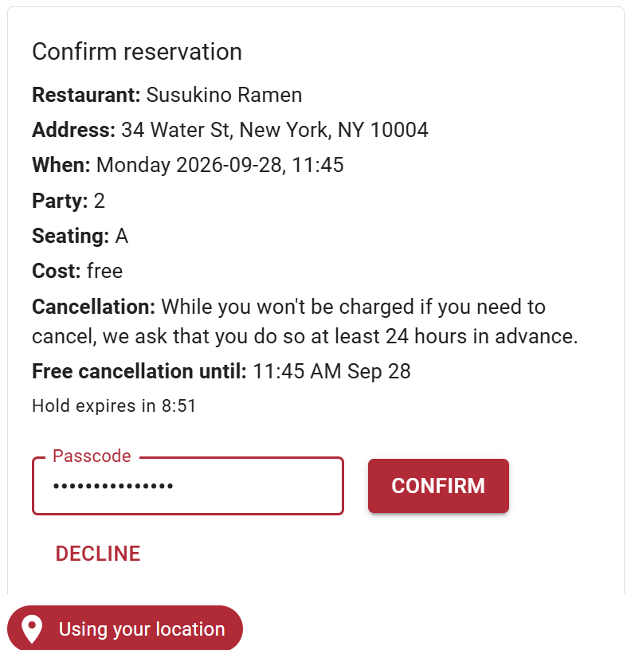
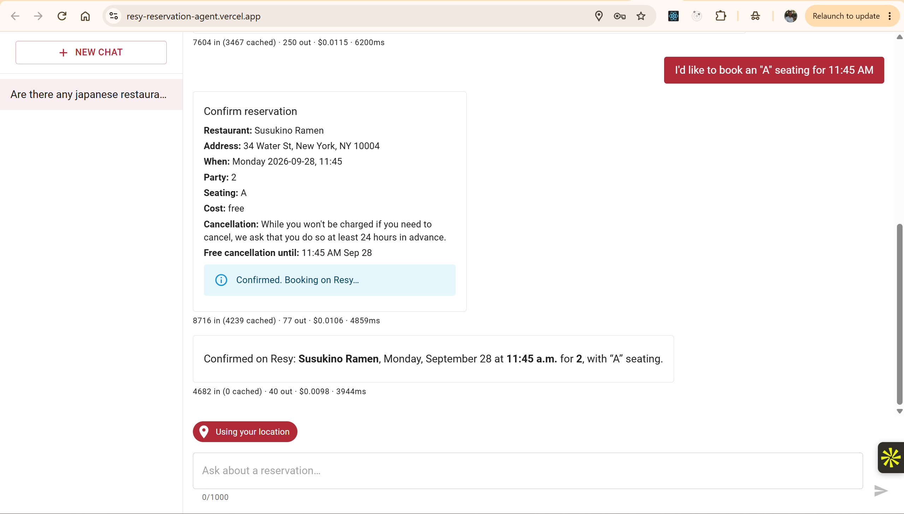
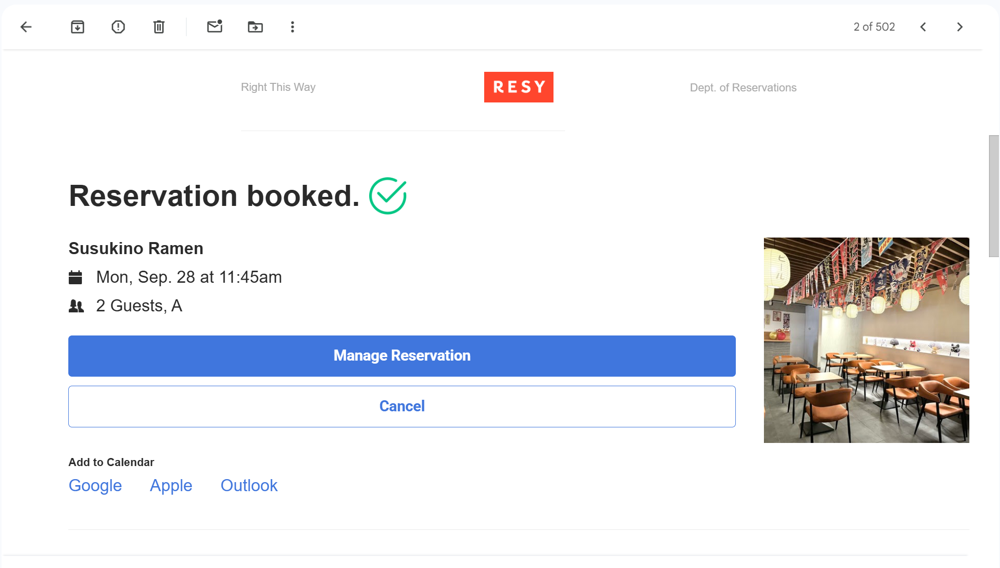
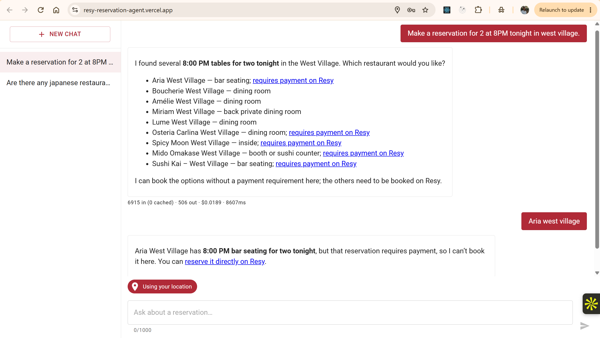
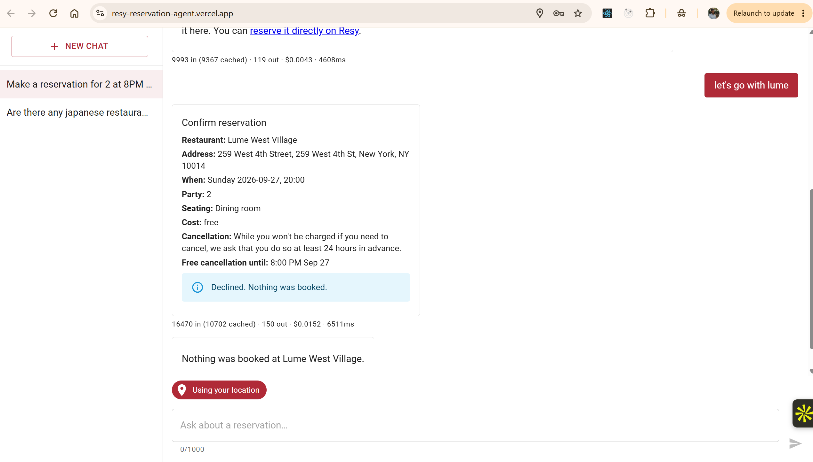

# Resy Reservation Agent

A chat agent that turns natural-language requests ("table for 2 in the Financial District Friday at 7pm") into real Resy availability, shows open times, and books only after the user explicitly confirms.

**Live app:** https://resy-reservation-agent.vercel.app
**Analytics:** Langfuse (traces, token usage, cost, latency). An in-app `/dashboard` is next; see [stage 8](docs/stage-08-analytics-dashboard.md).

**Scope: a reservation agent for one person (Amogh), for now.** Bookings go through Amogh's personal Resy account and are gated by a demo passcode that isn't published. Signing in every visitor and booking on their own Resy account is the next version. It was cut deliberately so this version could build and validate the reservation flow end to end first. Reservations that require payment are also cut: card handling and deposit flows need more engineering than fits this version. Anyone can search; only the passcode holder can book.

> **Before you try it**
>
> - **The first load can take about a minute.** The backend runs on Render's free tier and sleeps after 15 idle minutes.
> - **Choose your city first.** On first visit, pick a country and city (Resy's own list); the agent searches and books there, in that city's local time. Change it anytime from the location chip at the top right.

## Contents

1. [Screenshots](#screenshots)
2. [How it works](#how-it-works)
3. [Stack and rationale](#stack-and-rationale)
4. [Agent tools and the confirmation gate](#agent-tools-and-the-confirmation-gate)
5. [Observability](#observability)
6. [Testing](#testing)
7. [Trade-offs and scope cuts](#trade-offs-and-scope-cuts) and [what's next](#whats-next)
8. [Running locally](#running-locally), [environment variables](#environment-variables), [CI/CD](#cicd), [platform setup](#platform-setup)
9. [Disclaimer](#disclaimer)

## Screenshots

Real conversations with the deployed agent in New York, including a real reservation it booked (cancelled afterwards).

**1. Finding a table.** A cuisine search in the selected city: the agent lists Japanese restaurants in Resy's order, then shows open times for the one the user picks and asks which time and seating they want.



**2. Booking it.** The user picks a time and seating. The agent prepares the booking and shows the confirmation card (details, cancellation policy, cost, and a hold countdown). Nothing is booked until the user enters the passcode and clicks Confirm. The server then books on Resy, and Resy sends its own confirmation email.

| The confirmation card                                                  | Passcode entered                                                  |
| ---------------------------------------------------------------------- | ----------------------------------------------------------------- |
|    |  |

| Confirmed in the chat                                                                  | Resy's confirmation email                                                           |
| -------------------------------------------------------------------------------------- | ----------------------------------------------------------------------------------- |
|     |  |

**3. Paid reservations are refused.** A neighborhood search for 8 PM tonight in the West Village. Venues whose slots require payment are flagged with a Resy link; picking one gets an explanation instead of a booking.



**4. Declining.** Clicking Decline on the card books nothing, and the agent says so.



## How it works

```
Browser (React + MUI on Vercel)
  │  fetch + X-Session-Id header (sessionStorage guest ID)
  │  chat body: message, region (city slug from the region picker, kept in localStorage)
  │  SSE-formatted stream for chat
  ▼
FastAPI on Render (single instance, free tier)
  ├─ guards: rate limits (in-memory), spend cap (Postgres), input limits
  ├─ /api/regions ──► Resy city list (cached 24h, slimmed)
  ├─ /api/chat ──► LangGraph agent
  │                 ├─ call_model node (OpenAI via langchain-openai)
  │                 ├─ tools node ──► app/resy/ client ──► api.resy.com
  │                 └─ interrupt() before booking ◄── /api/bookings/{id}/confirm (passcode)
  └─ Postgres (Supabase, session pooler)
        ├─ conversations, daily_spend, pending_bookings   (Alembic)
        └─ LangGraph checkpoints                            (checkpointer setup())

Langfuse Cloud ◄── traces for every LLM call and tool call
```

**LangGraph flow.** Two nodes: `call_model` and `tools`.

1. `START → call_model`. The system prompt is rebuilt each turn with today's date and a 14-day calendar in the selected city's timezone, so the model never does weekday math.
2. `call_model → tools` when the model requests tool calls, and back to `call_model` with the results. It ends when the model replies with text.
3. The `book` tool calls `interrupt()`. The graph pauses, its state is saved by the Postgres checkpointer, and the chat stream sends a `confirmation_required` event that the UI renders as a confirmation card.
4. `POST /api/bookings/{id}/confirm` (with the passcode) or `/decline` resumes the graph with `Command(resume=…)`. The outcome streams back in the same SSE format.

**Request flow for "Book Brooklyn Chop House for 2 on Friday at 7pm":**

1. `search_availability` resolves the name (exact match only) and returns open times, with short slot IDs.
2. There's exactly one exact-time match, so the agent calls `prepare_booking`. This gets Resy's booking details and stores a pending booking (free reservations only).
3. It then calls `book` in the same turn. The graph pauses and the user sees the confirmation card.
4. The user enters the passcode and clicks Confirm. The server books once, never retries, and the agent confirms.

## Stack and rationale

| Layer         | Choice                                                                                                    |
| ------------- | --------------------------------------------------------------------------------------------------------- |
| Frontend      | React + TypeScript (strict), Vite, MUI, react-router, on **Vercel**                                       |
| Backend       | Python 3.11, FastAPI, uv, on **Render** (free web service)                                                |
| Agent         | LangGraph + LangChain (`langchain-openai`); model `gpt-6-sol` (configurable)                              |
| Database      | **Supabase as plain Postgres**: SQLAlchemy 2 (async, psycopg 3), Alembic, LangGraph Postgres checkpointer |
| Observability | **Langfuse** Cloud (Hobby)                                                                                |
| Reservations  | Resy's unofficial web API (`api.resy.com`)                                                                |

**Why Resy.** It has everything a reservation agent needs: restaurant search, live availability, booking details (cancellation policy, fees), and booking itself. Its web API is free to call and has been reverse-engineered and documented by the community, so no partner agreement is needed to build on it. Every endpoint used here was verified against captures from resy.com (see the endpoint table in [PLAN.md](docs/PLAN.md)). All Resy calls sit behind one module, `backend/app/resy/`.

**Agent and observability.** LangGraph for agent orchestration: explicit nodes and edges, conversation state persisted by its Postgres checkpointer, and `interrupt()` to pause before booking until the user confirms. Langfuse for tracing and analytics: per-call token usage, cost, and latency out of the box, a Metrics API for the planned in-app dashboard, and a free tier (50,000 units a month) that comfortably covers this project.

**Hosting.** Render (backend) and Vercel (frontend) were chosen for their free tiers. The trade-off is that Render's free web service sleeps after 15 minutes of inactivity and takes about a minute to wake. That's a budget constraint, not an architectural one: a paid instance removes it with no code changes. No keep-alive job was added, deliberately, as a budget scope cut.

**Database.** Supabase for managed Postgres on a free tier: no database server to run, a web dashboard and SQL editor for inspecting data, and an IPv4 connection pooler that works from Render. Schema migrations are handled in code with Alembic, so the app isn't tied to Supabase-specific features and could move to any Postgres host. Free projects pause after 7 days of inactivity; that's accepted as a budget constraint.

**Guest sessions (no authentication).** No authentication (scope cut); each browser tab gets an anonymous guest session ID. It's stored in `sessionStorage` so it's scoped to the tab and cleared on close, which limits how long a leaked ID is useful. Neither `sessionStorage` nor `localStorage` protects against XSS; an `httpOnly` cookie would, but the frontend and backend are on different domains, and cross-site cookies are blocked by many browsers. Fixing that needs a shared domain or proxy, which is out of scope. The session ID never authorizes booking; the demo passcode does.

**Regions and privacy.** Like resy.com, you pick a country and a city from Resy's own city list (`/3/location/config`, cached for 24 hours on the server). The choice is saved in your browser's `localStorage` and shown at the top right. Every request sends only the city's slug; the server looks up the search center, radius, and timezone from Resy's list. The browser never shares its location, and no coordinates are stored, logged, or sent to the analytics service. Asking about another city gets "change your location first", with the location chip highlighted. Slot times use each venue's own city timezone.

## Agent tools and the confirmation gate

| Tool                  | Resy endpoint                       | What it does                                                                                           |
| --------------------- | ----------------------------------- | ------------------------------------------------------------------------------------------------------ |
| `search_availability` | venue search, `/3/venue`, `/4/find` | Restaurant-name, cuisine, or neighborhood search near the user; open times in a window; short slot IDs |
| `get_venue_details`   | `/3/venue`                          | Description, address, cuisine, price, rating, Resy link                                                |
| `get_venue_calendar`  | `/4/venue/calendar`                 | Which dates have openings; "not released yet" vs. "fully booked"                                       |
| `prepare_booking`     | `/3/details` (`commit: 1`)          | Booking details and a server-side pending booking; **free reservations only**                          |
| `book`                | `/3/book`                           | Pauses with `interrupt()`; books only after Confirm + passcode                                         |

**Routing rules that keep the model honest** (in the system prompt; details in [stage 6](docs/stage-06-search-tool.md)):

- Resy search is fuzzy. Only an exact name match counts; otherwise the agent asks "did you mean…?" or says the venue isn't on Resy.
- It resolves the venue first, then asks for everything missing in one message, and never assumes a party size.
- It never picks an alternative time, venue, or seating for the user.
- If a request is fully specified and the exact slot is open, it goes straight to the confirmation card, with no "shall I book?".
- Dates after a venue's release horizon are "not released yet", never "fully booked".

**The confirmation gate: the LLM can't book on its own.** A booking happens only when all of these hold, enforced in server code and each covered by a test:

1. `book` was reached and the graph paused at `interrupt()`.
2. The user clicked Confirm, and `POST /api/bookings/{id}/confirm` passed its checks:
   - session ownership;
   - rate limit (5 attempts per 15 minutes per session and per IP);
   - constant-time passcode comparison;
   - the graph is paused on that exact booking.
3. An atomic `pending → confirming` update succeeded, and the resumed tool sees both `approved: true` and the `confirming` row.

Approval comes from the resume value and database state, never from LLM output or tool arguments.

**Safety details:**

- Book tokens stay server-side, referenced by short IDs. The LLM never sees Resy tokens or coordinates.
- `/3/book` is never retried. A timeout after sending is recorded as `unknown`, and the user is told to check the Resy app, to avoid double-booking.
- An expired book token is reissued at confirm time, and the reservation is checked again to make sure it's still free.

## Observability

Every chat turn is one Langfuse trace:

- the session is the conversation, and the user is the guest session;
- it contains LLM generations (tokens, cost, latency, time to first token) and tool spans;
- confirm and decline runs are tagged `booking_attempt` or `booking_declined`, with a `booking_outcome` event.

Traces never contain coordinates, the passcode, or Resy tokens. Logs are structured JSON with message lengths only, never message content.

**Per-message usage badge.** Under every agent reply, the chat shows that turn's usage, e.g. `7604 in (3467 cached) · 250 out · $0.0115 · 6200ms`: input tokens (and how many came from OpenAI's prompt cache), output tokens, cost, and total turn latency. It's summed over every model call in the turn; a turn that uses tools makes several. Cost is computed on the server from the price table in `backend/app/observability/pricing.py`: (input − cached) × input rate + cached × cached rate + output × output rate. It's sent to the browser as the stream's `usage` event when the turn ends. The same per-call cost also counts toward the daily spend cap.

## Testing

- **Unit and integration tests** (`backend/tests/`, run in CI) cover the Resy client, the search rules, every tool, and each check in the confirmation gate. Resy is never called: tests use recorded, scrubbed responses (`tests/fixtures/resy/`) behind a mocked HTTP transport.
- **End-to-end test** (`tests/test_e2e.py`, runs in CI): drives the API through the whole flow, from search to details, calendar, prepare, the confirmation card, confirm, and booked. It uses a scripted model and recorded Resy responses.
- **Evals** (`backend/evals/`, manual, costs money): 26 cases covering dates, routing, location and timezone, and safety. They run against the real model with stub tools (the production tool names and schemas, with canned outputs, so no Resy calls). Run: `uv run python -m evals.run --model gpt-6-sol`.

## Trade-offs and scope cuts

- **One user, not every visitor.** No sign-in; bookings use one personal Resy account and require the demo passcode. Each browser tab gets an anonymous guest session (`sessionStorage`), which identifies conversations but never authorizes a booking. Cut to build and validate the reservation flow first; per-user sign-in and Resy account linking are the next version.
- **Free reservations only.** Reservations that require payment, a card on file, or a cancellation fee are refused with a link to book on Resy. Supporting them needs card handling and deposit flows, which is more engineering than fits this version.
- **One city at a time.** Searches stay within the selected Resy city (its center and radius); switching cities applies to the next message. No free-text geocoding ("near the Eiffel Tower") or device geolocation.
- **Free-tier hosting.** Render sleeps after 15 idle minutes (about a minute to wake); Supabase pauses after 7 idle days. No keep-alive jobs (budget).
- **Single instance.** Rate limits and the slot-ID map are in memory and reset on restart. Resy responses aren't cached.
- **No canary or alerting** (budget). Breakage shows up as typed Resy errors in logs and Langfuse traces.
- **No list or cancel tools.** Deferred; cancellations happen in the Resy app.
- **Manual evals**, not in CI (they cost money per run).
- **Analytics in Langfuse** for now; the in-app dashboard is next.
- **Not planned:** hot-table sniping / Priority Notify, other reservation platforms (all Resy code is isolated in `backend/app/resy/`, so another platform would be another client behind the same tools), languages other than English.

## What's next

1. Sign-in for every visitor, with each user linking their own Resy account.
2. In-app analytics dashboard.
3. Searching near a street address or landmark (geocoding) within the selected city.
4. List and cancel reservations, reusing the confirmation gate.
5. Paid reservations (card on file, deposits, cancellation fees).
6. Automatic Resy token refresh.

## Running locally

Backend (from `backend/`):

```
uv sync
uv run uvicorn app.main:app --reload     # Windows: add --loop none
uv run pytest                            # unit tests; integration tests need DATABASE_URL
uv run ruff format . && uv run ruff check . && uv run pyright
uv run alembic upgrade head
```

Frontend (from `frontend/`):

```
npm ci
npm run dev
npm run typecheck && npm run lint && npm run format:check && npm test && npm run build
```

Copy each `.env.example` to `.env` and fill in values. `uv run python -m scripts.chat_cli --region new-york-ny` chats with the agent from the terminal; `scripts/resy_probe.py` checks Resy credentials (read-only).

### Environment variables

Backend (`backend/.env`, mirrored on Render):

| Variable                                                                                               | Purpose                                                             |
| ------------------------------------------------------------------------------------------------------ | ------------------------------------------------------------------- |
| `APP_ENV`, `CORS_ORIGINS`                                                                              | Environment tag, allowed frontend origins                           |
| `OPENAI_API_KEY`, `OPENAI_MODEL` (`gpt-6-sol`)                                                         | LLM                                                                 |
| `DATABASE_URL`                                                                                         | Supabase session pooler, `postgresql+psycopg://…:5432/postgres`     |
| `LANGFUSE_PUBLIC_KEY`, `LANGFUSE_SECRET_KEY`, `LANGFUSE_HOST`                                          | Tracing                                                             |
| `RESY_API_KEY`, `RESY_AUTH_TOKEN`                                                                      | Personal Resy account (rotated by hand)                             |
| `RESY_WRITES_ENABLED`                                                                                  | `true` only in production; otherwise the client refuses to book     |
| `DEMO_BOOKING_PASSCODE`                                                                                | Required to confirm a booking; empty means every confirm is refused |
| `DAILY_SPEND_CAP_USD`, `RATE_LIMIT_SESSION_PER_MIN`, `RATE_LIMIT_IP_PER_HOUR`, `RATE_LIMIT_IP_PER_DAY` | Abuse and cost guards                                               |
| `MAX_MESSAGE_CHARS`, `MAX_TURNS_PER_CONVERSATION`                                                      | Input limits                                                        |

Frontend (`frontend/.env`, mirrored on Vercel): `VITE_API_BASE_URL`, the full Render URL including `https://`. It's the frontend's only variable; no secrets reach the browser.

### Resy credentials

The backend uses one personal Resy account. `RESY_API_KEY` and `RESY_AUTH_TOKEN` come from resy.com: log in, open DevTools → Network, and copy the `api_key` from any `api.resy.com` request's `Authorization` header and the `X-Resy-Auth-Token` header value. The token is static (no automatic refresh; it lasts weeks), so when Resy calls start failing with an auth error, repeat this and update the value in `backend/.env` and on Render. Check them locally with the read-only probe: `uv run python -m scripts.resy_probe`.

### CI/CD

- **`ci.yml`** (every PR to `master`):
  - frontend: typecheck, lint, prettier, vitest, build;
  - backend: ruff, pyright, `alembic upgrade head` on a Postgres service container, then pytest (unit, integration, E2E).
- **`deploy.yml`** (merge to `master`): runs the same checks, then:
  - migrates the production database;
  - triggers Render's deploy hook;
  - builds and deploys the frontend with the Vercel CLI.

  Auto-deploy is off on both platforms, so only this workflow deploys.

### Platform setup

**Render (backend):**

1. New web service from this repo, root directory `backend`, Python 3.11 (`backend/.python-version`).
2. Build command: install `uv`, then `uv sync --frozen --no-dev`.
3. Start command: `uv run --no-sync uvicorn app.main:app --host 0.0.0.0 --port $PORT`.
4. Auto-Deploy off. Copy the deploy hook URL into the GitHub secret `RENDER_DEPLOY_HOOK_URL`.
5. Set the backend env vars. `CORS_ORIGINS` must include the Vercel domain.

**Vercel (frontend):**

1. Root directory `frontend`, framework Vite.
2. Git auto-deploy is off via `frontend/vercel.json` (`git.deploymentEnabled: false`).
3. Set `VITE_API_BASE_URL` for Production. Don't mark it Sensitive: `vercel pull` in CI can't read sensitive values.
4. The repo must be under a personal GitHub account (Hobby plan).

**GitHub:**

1. Secrets: `DATABASE_URL`, `RENDER_DEPLOY_HOOK_URL`, `VERCEL_TOKEN`, `VERCEL_ORG_ID` (the team ID, `team_…`), `VERCEL_PROJECT_ID`.
2. Branch protection on `master`: require pull requests and the `frontend` and `backend` checks.

## Disclaimer

This project uses Resy's **unofficial** web API. It isn't affiliated with or endorsed by Resy, and it's used at low volume with a personal account. Endpoint shapes come from browser DevTools captures of resy.com (see the endpoint table in [PLAN.md](docs/PLAN.md)).

Build plan and per-stage decisions: [docs/PLAN.md](docs/PLAN.md) and `docs/stage-*.md`.
